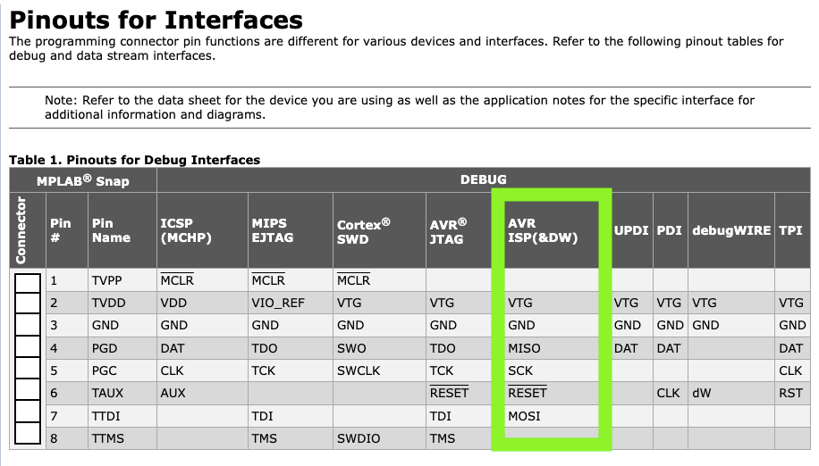

# Building a Raspberry Pi C development platform

## Introduction

These are the steps to create a *complete and up-to-date* Standard C development platform on a Raspberry Pi. The steps accomplish the following:

0. Updates the OS and adds all prerequisites
1. Installs avr-binutils (2.43.1)
2. Installs avr-gcc (15.1)
3. Installs latest version of avr-libc [github](https://github.com/avrdudes/avr-libc)
4. Installs latest version of avrdude [github](https://github.com/avrdudes/avrdude/)
5. Adds the[ AVR_C](https://github.com/lkoepsel/AVR_C/tree/main) library and uses it to test the above
6. Adds [tio](https://github.com/tio/tio?tab=readme-ov-file), a *CLI-based* serial monitor 
7. Install VS Code configuration files for C/C++ and creates default build tasks *AVR_C*
8. *(Optional)* Adds a [hello service](https://github.com/lkoepsel/hello), for identifying the *RPi* in large networks
9. *(Optional)* Installs avr-gdb and [bloom](https://bloom.oscillate.io/) for hardware debugging

There are incremental builds, this allows reverting back and attempting steps without a complete restart:
* pibuildv1.img - step 0, initial setup for a up to date *Raspberry Pi*
* pibuildv2.img - steps 0-2, add avr-binutils and avr-gcc, longest compilation time
* pibuildv3.img - steps 0-7, add tools required to interact and load with *AVR* boards such as the *Arduino Uno*
* pibuildv4.img - steps 0-9, optional steps with hello service and hardware debug

It requires connecting to the *RPi* via the command line (*Windows/Terminal*, *macOS/Terminal or Warp*). The best way to perform these steps, are to have this page open along side the CLI and simply copy and paste. 

**Note: Not all commands can be copy and pasted directly, these will be noted.**

**Note: I used a Pi 4 with 8GB of memory. The time in parentheses is the typical time for completion of the specific step. If the step is relatively fast, the times won't be shown. With less memory it might take longer. Clearly with a Pi 5, the times will be much shorter and I wouldn't attempt with a Pi 3.**

## Downloading the Image instead of building the image:
In some situations, you might be in a classroom where the instructor has already built the appropriate image. In that case, follow the steps below **up to step 0.**

Your instructor will provide the IP address of the image server, replace the number *192.168.1.112:8000* below with the one, they provide.

### Download the image:
```bash
# on host system
# to see files listed (in html format) or use your browser to see the page
curl http://192.168.1.112:8000

# to download file
cd ~/Downloads
wget http://192.168.1.112:8000/pibuildv4_gm.img.gz

```

**And for *step 2. CHOOSE OS...*, go to the bottom of the list, *Use custom* and navigate to the file you downloaded above.** Then continue with the instructions, below.

## Use Raspberry Pi Imager to start:
**On your PC** use *Pi Imager* to install a Raspberry Pi OS image on to an SD Card. The selections are:
1. CHOOSE DEVICE -> Raspberry Pi 4
1. CHOOSE OS -> Raspberry Pi OS (other) -> Raspberry Pi OS Lite (64-bit)
1. CHOOSE STORAGE -> **ENSURE THIS IS YOUR SD CARD!**
#### Edit Custom Settings
1. **General** tab: (set per your location)
    * *Set hostname*: to be unique to you if you are in an environment with multiple installations
    * *Set username...*: its best to have it be the same username on your PC and **remember the password you assign**
    * make sure the wi-fi is the same SSD as your PC
    * set locale to your time zone and keyboard layout as desired (in US, set to "*us*")
1. **SERVICES** Select "Allow public-key...", click *RUN SSH-KEYGEN* if required
1. **OPTIONS** Select all

Click *SAVE* then *Yes*, *Yes*.

**CONFIRM you are writing to the SD Card** then authenticate to allow Pi Imager to write to the SD Card.

Once Pi Imager has completed, remove the card and place in your RPi. Plug-in power and wait... :)

## Connect
The *RPi* will take at least 3 minutes for inital boot, then you may attempt to login. Replace *hostname* with the name you assigned in the step above. Connect using **one of the two commands** below:
```bash
# if your username on your PC is exactly the same as the username you used in Pi Imager
ssh hostname.local
# if the usernames are different, use the username you used in Pi Imager, below
ssh username@hostname.local
```

## 0. Update to latest software and add dependencies (7m 4s)
```bash
# update OS
sudo apt update && sudo apt full-upgrade -y

# install build dependencies for both avr-gcc and avrdude
sudo apt install -y make bison flex gawk texinfo libtool autoconf automake libusb-dev gcc g++ gperf git magic-wormhole meson tree
sudo apt install -y build-essential cmake pkg-config libelf-dev libhidapi-dev libftdi1-dev libreadline-dev libserialport-dev hdparm
```
## ******** pibuildv1.img includes above steps ********
## 1. avr-binutils 
### 1.1. Download source
```bash
# this process will use your home_folder/avr-build to create the tool chain
cd
mkdir ~/avr-build
cd ~/avr-build
wget https://ftp.gnu.org/gnu/binutils/binutils-2.43.1.tar.gz
tar -xzf binutils-2.43.1.tar.gz

```

### 1.2. Build and install (4m 12s)
```bash
cd binutils-2.43.1
./configure --prefix=/usr/local/avr --target=avr --disable-nls --disable-werror 
make -j 4
sudo make install
```

## 2. avr-gcc
### 2.1. Download source 
```bash
cd ~/avr-build
wget https://ftp.gnu.org/gnu/gcc/gcc-15.1.0/gcc-15.1.0.tar.gz
tar -xzf gcc-15.1.0.tar.gz
```

## 2.2 Build and install (51m 14s for 9.5, 1hr 56m for 14.1)
```bash
cd gcc-15.1.0
./contrib/download_prerequisites
mkdir build
cd build
../configure --prefix=/usr/local/avr --target=avr --enable-languages=c,c++ --disable-nls --disable-libssp --with-dwarf2 --disable-shared --enable-static --enable-plugin --with-gnu-as
make -j 4
sudo make install
```

## Update path
```bash
echo 'export PATH="/usr/local/avr/bin:$PATH"' >> ~/.bashrc
source ~/.bashrc
```
## ******** pibuildv2.img includes above steps ********

## avr-libc
### 3.1 Download the source
```bash
cd ~/avr-build
git clone https://github.com/avrdudes/avr-libc.git
```

### 3.2 build and install ( 19m 40s)
This step requires a minor hack to make it work. I originally used `sudo make install`, as the last step, however, the install would fail as *sudo* loses the path to *runlib* and the install would fail. 

To fix, I change the ownership temporarily to myself (*lkoepsel*), run `make install` (dropping *sudo*) and everything seems to work. At the end, I change the ownership back to *root*. 

You will need to change the username `lkoepsel` in the bulletized statement below, to the username you use to login (*the name you used in the Pi Imager*):

* `sudo chown -R lkoepsel /usr/local/avr` **change lkoepsel to your username**


```bash
cd ~/avr-build/avr-libc
./bootstrap
./configure --build=`./config.guess` --host=avr --prefix=/usr/local/avr
# be sure to change the username!
sudo chown -R lkoepsel /usr/local/avr
make -j 4
make install
sudo chown -R root /usr/local/avr
```

## 4. avrdude
### 4.1 Download source
```bash
cd ~/avr-build
git clone https://github.com/avrdudes/avrdude.git
```

### 4.2 build and install
```bash
cd avrdude
# install prerequisites
./build.sh
sudo cmake --build build_linux --target install
```

## 5. Add AVR_C and test
* Add [AVR_C/docs/env.make](https://github.com/lkoepsel/AVR_C/blob/main/docs/env_make.md)
```bash
# clone AVR_C and test compile/link/load
cd
git clone https://github.com/lkoepsel/AVR_C.git
cd AVR_C
nano env.make
# copy/paste from from link above
# be sure to assign the correct serial port!
cd examples/blink
make flash
```

## 6. Update tio to latest
The CLI serial monitor program *tio* is quite handy and has been upgraded significantly in the last year. The new version is at least 3.9 and will be installed.
```bash
cd ~/avr-build
wget https://github.com/tio/tio/releases/download/v3.9/tio-3.9.tar.xz
tar -xvf tio-3.9.tar.xz
cd tio-3.9/
sudo apt install -y libglib2.0-dev liblua5.2-dev
meson setup build
meson compile -C build
sudo meson install -C build
cd
# remove build directory, its quite large, might take a few minutes
rm -rf avr-build/
nano .tioconfig
```

```bash
[default]
baudrate = 250000
databits = 8
parity = none
stopbits = 1
local-echo = true
color = 11

[acm]
device = /dev/ttyACM0
color = 12

[usb]
device = /dev/ttyUSB0
color = 15

[usb-devices]
pattern = ^usb([0-9]*)
device = /dev/ttyUSB%m1
color = 14
```
*Ctrl-S* (save) *Ctrl-X*(exit)

## 7. Setup VS Code

**If not already installed, you will want to install the following extensions on the Raspberry Pi:**
* Name: **C/C++** Description: C/C++ IntelliSense, debugging, and code browsing.
* Name: **C/C++ Themes** Description: UI Themes for C/C++ extension.
* Name: **Remote - SSH** Description: Open any folder on a remote machine using SSH and take advantage of VS Code's full feature set.
* Name: **Remote - SSH: Editing Configuration Files** Description: Edit SSH configuration files
* Name: **Remote Explorer** Description: View remote machines for SSH and Tunnels.

Perform these steps in VS Code on your host system:

### 7.1 Connect via Remote SSH
1. *CMD-Shift-P -> "C/C++" -> Remote SSH*
2. Enter the hostname (and credentials, if required) that you use in the CLI
3. VS Code will download the SSH Server and other extensions required

Ensure you do not have any files open in VS Code for the next two steps.
### 7.2 C/C++ Configuration Installation
**If you are on Windows, use Ctrl, instead of CMD.**

1. *CMD-Shift-P -> "C/C++" -> C/C++: Edit Configurations (JSON))*
2. Copy the content below then in *VS Code CMD-a* to select all of the existing *c_cpp_properties.json* file
3. *CMD-v* to paste and *CMD-s* to save. 

## c_cpp_properties.json
```json
{
    "configurations": [
        {
            "name": "AVR",
            "includePath": [
                "/usr/local/avr/avr/",
                "/usr/local/avr/include/**",
                "/usr/local/avr/avr/include/avr/",
                "${workspaceFolder}/**"
            ],
            "defines": ["__AVR_ATmega328P__"],
            "compilerPath": "/usr/local/avr/bin/avr-gcc", 
            "compilerArgs": [ ],
            "cStandard": "c99",
            "cppStandard": "c++98",
            "intelliSenseMode": "${default}"
        }
    ],
    "version": 4
}
```

## 7.3 Default Task Installation
**If you are on Windows, use Ctrl, instead of CMD.**

1. *CMD-Shift-P -> "task" -> Tasks: Configure Default Build Task _> Create...from template -> Others Example...* 
2. Copy the content below then in *VS Code CMD-A* to select all of the existing *tasks.json* file
3. *CMD-v* to paste and *CMD-s* to save. 

## tasks.json
```json
{
    "version": "2.0.0",
    "tasks": [
        {
            "label": "make",
            "detail": "Run make",
            "type": "shell",
            "command": "/usr/bin/make ${input:makeTarget}",
            "options": {
                "cwd": "${fileDirname}"
            },
            "presentation": {
                "reveal": "always",
                "panel": "dedicated"
              },        
            "group": {
                "kind": "build",
                "isDefault": true
            }
        }
    ],
    "inputs": [
        {
            "type": "pickString",
            "id": "makeTarget",
            "description": "Select a make target",
            "options": [
                {   
                    "value": "flash",
                    "label": "compile and upload code (upload)"
                },
                {   
                    "value": "compile",
                    "label": "only compile code (verify)"
                },
                {   
                    "value": "clean",
                    "label": "remove non-source files"
                },
                {   
                    "value": "complete",
                    "label": "complete re-compile with verbose upload"
                },
                {   
                    "value": "verbose",
                    "label": "verbose upload to debug serial connection"
                },
                {   
                    "value": "env",
                    "label": "print env variables being used"
                },
                {   
                    "value": "help",
                    "label": "print make commands"
                }
            ],
            "default": " flash"
        }
    ]
}
```
## ******** pibuildv3.img includes above steps ********

**Note: The *hello service* step below requires Python and the Python flask library to be installed on your PC. If you don't require an automatic notification by the *RPi* when it starts up, you may skip the step. Its typically required in large networks (colleges and universities), where its more difficult to ascertain the IP address or to use *Bonjour*.**

## 8. Add hello service
You may clone [hello](https://github.com/lkoepsel/hello) on your PC (host system) or simply download *hello_server.py* in the repository for this capability. This Python *flask* application will report its IP address then wait for a connection by the *RPi*. Use IP address for step 8.2 below. To run the server program locally:

### On host system (your PC)
On your host system, in your CLI , open another tab (*File -> New Tab*).
```bash
# on host system in a different window
cd hello
python -m hello_server
# to quit, press Ctrl-C
```

### Remaining steps on *RPi* tab in your CLI
### 8.1. Add hello.py
```bash
# open a file named hello.py
sudo nano /usr/bin/hello.py
```

```python
import logging
import requests
import socket
import os
import sys


hadtomount = False

if not os.path.exists('/boot/firmware'):
    hadtomount = True
    os.system("sudo mount /dev/mmcblk0p1 /boot/firmware")

# set logging to DEBUG, if not showing up
logging.basicConfig(filename='/boot/firmware/hello.log', encoding='utf-8',
                    format='%(asctime)s %(filename)s:%(levelname)s: %(message)s',
                    level=logging.DEBUG)

IP_file = "hello_ip.txt"  # Replace with your desired file name

# List of directories to search
dirs_to_check = ["/boot", "/boot/firmware"]

# Search for the file in the listed directories
for dir_path in dirs_to_check:
    file_path = os.path.join(dir_path, IP_file)
    if os.path.isfile(file_path):
        try:
            with open(file_path, "r") as f:
                ip = f.read().rstrip("\n")
                logging.debug("IP address found in %s", file_path)
            break  # Exit the loop if the file is found and opened successfully
        except IOError:
            logging.error("Error opening file: %s", file_path)
            sys.exit(0)
else:
    logging.error("%s not found in %s ", IP_file, dirs_to_check)
    sys.exit(0)

if hadtomount:
    os.system("sudo umount /boot/firmware")

host_name = socket.gethostname()
logging.debug("Host name: %s  ", host_name)

url = 'http://' + ip
text = f"Hello from {host_name}"
logging.debug(url)

data = {'text': text}

try:
    response = requests.post(url, data=data)

except requests.exceptions.RequestException as e:
    logging.error(e)
    sys.exit(1)

logging.debug(response.status_code)
logging.debug(response.text)
```
*Ctrl-S* (save) *Ctrl-X*(exit)
### 8.2. Add *hello_ip.txt*
This step identifies your PC by IP address to the Raspberry Pi:

1. Run `python -m hello_server` from [*hello*](https://github.com/lkoepsel/hello) folder on your PC, this will report the IP address of your PC.
1. Open a the file to contain the IP address.

```bash
sudo nano /boot/firmware/hello_ip.txt
```

Enter the only the numeric IP address of your PC WITHOUT a return at the end of the line. The file *hello_ip.txt* will need to look like:

```bash
192.168.1.124
```
*Ctrl-S* (save) *Ctrl-X* (exit)

**Note:** By storing the IP address in a file at */boot/firmware*, you may access the file on a macOS or Windows system. The *boot/firmware* folder shows up as a readable folder on either system called *bootfs*. This enables you to change the IP address on your PC then re-insert the SD Card into the *RPi* to ping you at a new address. 

There is also a file on *boot/firmware* called *hello.log*, which you can open with a text editor. It will contain the log entries for the *hello.service*. Use these entries if you are having difficulty getting a ping from the *RPi.* 

### 8.3. Setup systemd for hello.service
```bash
sudo nano /lib/systemd/system/hello.service
```
```service
[Unit]
Description=Ping a known server (hello_ip.txt) with hostname and IP address
After=network-online.target
Wants=network-online.target

[Service]
Type=simple
ExecStart=/usr/bin/python /usr/bin/hello.py
Restart=on-failure
RestartSec=1
StartLimitInterval=0
StartLimitBurst=5

[Install]
WantedBy=multi-user.target
```
*Ctrl-S* (save) *Ctrl-X* (exit)

#### Test the Service
Run the following commands to create service and test it. (**Go to the hello tab and confirm the hello message appears**):
```bash
sudo chmod 644 /lib/systemd/system/hello.service
sudo systemctl daemon-reload
# start and check service
sudo systemctl start hello.service
sudo systemctl status hello.service
# press q to quit status
```

#### Enable the Service
If you see the IP address, then enable the service. If you don't, confirm you are on the same network and have the correct IP address. Your *RPi* will reboot after this step. **This step to enable the service must be executed in order for the service to work.**
```bash
# if hello.service is running well, then enable to run on boot
sudo systemctl enable hello.service
# reboot and test
sudo reboot now
# on host system, run hello_server.py
```
In *hello* tab of your CLI, watch for the *RPi* to ping the server. When it does, login to the *RPi* with a `ssh username@hostname.local` or `ssh hostname.local` and continue with the steps below.

## 9. Setup for hardware debugging

**Note: This step is only required if you wish to do hardware debugging. To use hardware debugging, the Reset connection must [be cut on an Uno](https://wellys.com/posts/avr_c_gdb/) or use a board with a built-in debugger such as the [*Microchip XPLAINED 328PB Mini*](https://wellys.com/posts/avr_c_328pb/).**


### 9.1 Install avr-gdb
```bash
sudo apt update
sudo apt install gdb-avr
```
### 9.2 Add ~/.gdbinit
```bash
cd
nano .gdbinit
```

```bash
set history save on
set history size 10000
set history filename ~/.gdb_history

file main.elf
target remote :1442
wh src 20

define cll
make
load main.elf
mon reset
refresh
list
end

define l20
wh src 20
end
```
*Ctrl-S* (save) *Ctrl-X* (exit)

### 9.3 Install Bloom
[Bloom](https://bloom.oscillate.io/) is a significant upgrade to avarice. It works incredibly well and provides the gdb-server connection required for avr-gdb. 
```bash
cd
wget https://github.com/bloombloombloom/Bloom/releases/download/v2.0.0/Bloom-headless-2.0.0-Linux-aarch64.deb
sudo apt install ./Bloom-headless-2.0.0-Linux-aarch64.deb
rm Bloom-headless-2.0.0-Linux-aarch64.deb
```

### 9.4 Edit bloom configuration
```bash
cd AVR_C
# initialize bloom to have it create yaml file
bloom init
nano bloom.yaml
```
```yaml
environments:
  default:
    shutdown_post_debug_session: true

    tool:
      name: "xplained_mini"
 
    target:
      name: "atmega328pb"
      physical_interface: "debug_wire"
      hardware_breakpoints: true
      manage_dwen_fuse_bit: true

    server:
      name: "avr_gdb_rsp"
      ip_address: "127.0.0.1"
      port: 1442
```
*Ctrl-S* (save) *Ctrl-X* (exit)

### SNAP Connections



### 9.5 Test connection
```bash
# for SNAP
avrdude -p m328p -P usb  -c snap_isp -t
# or for XPLAINED MINI
avrdude -p m328pb -P usb  -c xplainedmini_isp -t
# part to print details
# q to quit
```

### 9.6 Change env.make to use SNAP or XPLAINED MINI
You will need to do the following:
1. **Comment** out by placing a "# " in front of all of the lines of the current configuration which is titled "# *Arduino UNO et al using Optiboot (standard Arduino IDE approach)*"

Do **one of the two** options below, based on the board configuration

2.a. SNAP: **Uncomment** by removing the "# " in front of the lines **UNDER** "# *Arduino UNO and compatible boards using Atmel SNAP in ISP mode*". **Do not remove the "# " from the title comment.**

**OR**

2.b. XPLAIN: **Uncomment** by removing the "# " in front of the lines **UNDER** "# *Microchip 328PB Xplained Mini board*". **Do not remove the "# " from the title comment.**


### 9.7 Commands to start hardware debugging (**don't copy and paste**), note it uses two tabs in the *CLI*
```bash
# in tab 1
cd ~/AVR_C
# pick one of the two options for bloom, below
bloom {xplain | snap}

# File -> New tab, in the tab that opens
cd ~/AVR_C/examples/blink
avr-gdb --tui
```
## ******** pibuildv4.img includes above steps ********

## Notes:
### CLI Utilities
* `nmtui` - Text User Interface for controlling NetworkManager

### Enable Both Password and Publickey SSH Authentication 
```bash
sudo nano /etc/ssh/sshd_config
# ensure both of these lines are not commented
PasswordAuthentication yes
PubkeyAuthentication yes
# exit nano
sudo reboot now
```

### Update Firmware
[Update Raspberry Pi Bootloader](https://bret.dk/update-raspberry-pi-bootloader/)

```bash
# check current version
rpi-eeprom-update

# Make sure system is up to date
sudo apt update
sudo apt full-upgrade

# Update the Firmware
sudo rpi-eeprom-update -a

# reboot per instructions
sudo reboot now

# check version again
rpi-eeprom-update
```
### Change the boot-order (valuable on a Pi5)
```bash
# edit the config file
sudo -E rpi-eeprom-config --edit
```

```bash
BOOT_ORDER=0xf46
```

| Value | MODE | Description |
| ----- | ---- | ----------- |
| 0x4 | USB-MSD | USB Mass storage device |
| 0x6 | NVME | NVME SSD |
| 0xf | RESTART | Restart from the first boot-mode in the BOOT_ORDER field i.e. loop. |

[Rasberry Pi BOOT_ORDER](https://www.raspberrypi.com/documentation/computers/raspberry-pi.html#BOOT_ORDER)

### Toggle the power led
```bash
# turn off 
echo 0 | sudo tee /sys/class/leds/PWR/brightness
# turn on
sudo echo 1 | tee /sys/class/leds/PWR/brightness
```

### Saving, shrinking and sending an image
```bash
# to install pishrink:
# install dependencies
sudo apt update && sudo apt install -y wget parted gzip pigz xz-utils udev e2fsprogs
# install pishrink
wget https://raw.githubusercontent.com/Drewsif/PiShrink/master/pishrink.sh
chmod +x pishrink.sh
sudo mv pishrink.sh /usr/local/bin
# remove SD Card or USB drive containing RPi image and place in Linux PC
# determine physical device
lsblk
# find specific drive "sdc", "sdd" which is the right size of RPi drive, use as input
sudo ddrescue /dev/sda ./pibuildv3.img usb_backup.log
# shrink the size of the image to save space
sudo pishrink.sh -avz pibuildv3.img
# Easy way to send a file, requires magic-wormhole to be installed on receiving system
wormhole send pibuildv3.img.gz
```

### Linux Serial Permissions
If the *RPi* appears to be having permissions issues with opening the *SNAP* or *XPLAIN* USB port, add a *UDEV* rule to allow it.

#### Testing
Typically, the error is from *avrdude* where is states it has insufficient permissions to access the port. To test, use *avrdude* with and without, `sudo`.
```bash
# This does not work
avrdude -p m328p -P usb  -c snap_isp -t
# This does work
sudo avrdude -p m328p -P usb  -c snap_isp -t
```
Type `q` to quit, if either command works and connects to the Uno. If `sudo` is required, implement the solution below.

#### Solution

```bash
# for Microchip SNAP and XPLAINED MINI 328PB
sudo nano /etc/udev/rules.d/50-myusb.rules
```
Below are two lines, the first is for the SNAP and the second for the XPLAIN
```bash
SUBSYSTEMS=="usb", ATTRS{idVendor}=="03eb", ATTRS{idProduct}=="2180", GROUP="plugdev", MODE="0660", TAG+="uaccess"
SUBSYSTEMS=="usb", ATTRS{idVendor}=="03eb", ATTRS{idProduct}=="2145", GROUP="plugdev", MODE="0660", TAG+="uaccess"
```
*Ctrl-S* (save) *Ctrl-X* (exit), then **reboot**:
```bash
sudo reboot now
```

#### More Details on Serial Permissions
1. Run dmesg to determine idVendor and idProduct of the USB interfaces (in this case there are two.)
2. Use sudo and your favorite editor to create a file: "/etc/udev/rules.d/50-myusb.rules"
3. Using the idVendor and idProduct numbers, create two lines in the file using this format (replacing the numbers shown with your numbers):

SUBSYSTEMS=="usb", ATTRS{idVendor}=="2e8a", ATTRS{idProduct}=="0004", GROUP="plugdev", MODE="0660", TAG+="uaccess"

4. Save and close the file then restart your system.

#### Examples for other devices
```bash
# use dmesg to determine idVendor and idProduct
# be sure to use the right USB devices (such as usb 1-1 and usb 1-2 below)
dmesg
# ...
[62603.487834] usb 1-1: New USB device found, idVendor=0403, idProduct=6001, bcdDevice= 6.00
...
[62603.492032] usb 1-1: FTDI USB Serial Device converter now attached to ttyUSB0
...
[62607.143187] usb 1-2: New USB device found, idVendor=2e8a, idProduct=0004, bcdDevice= 1.00
...
[62607.145394] cdc_acm 1-2:1.0: ttyACM0: USB ACM device
# Bookworm with Microchip SNAP
[    2.521599] usb 1-1.4: New USB device found, idVendor=03eb, idProduct=2180, bcdDevice= 1.00

sudo nano /etc/udev/rules.d/50-myusb.rules
SUBSYSTEMS=="usb", ATTRS{idVendor}=="0403", ATTRS{idProduct}=="6001", GROUP="plugdev", MODE="0660", TAG+="uaccess"
SUBSYSTEMS=="usb", ATTRS{idVendor}=="2e8a", ATTRS{idProduct}=="0004", GROUP="plugdev", MODE="0660", TAG+="uaccess"
SUBSYSTEMS=="usb", ATTRS{idVendor}=="03eb", ATTRS{idProduct}=="2180", GROUP="plugdev", MODE="0660", TAG+="uaccess"
```

### Another example (from Warp) AI as to managing permissions
#### Example with Bloom
```bash
bloom 
2025-05-30 08:36:19.405 PDT [MT]: [WARNING] The Insight component has been excluded from this build. All Insight related configuration parameters will be ignored.
2025-05-30 08:36:19.408 PDT [MT]: [INFO] Selected environment: "default"
2025-05-30 08:36:19.409 PDT [TC]: [INFO] Starting TargetController
2025-05-30 08:36:19.429 PDT [TC]: [INFO] Connecting to debug tool
2025-05-30 08:36:29.451 PDT [TC]: [ERROR] The TargetController encountered a fatal error. See below for errors:
2025-05-30 08:36:29.451 PDT [TC]: [ERROR] Failed to write data to HID interface.
2025-05-30 08:36:29.451 PDT [TC]: [INFO] Shutting down TargetController
2025-05-30 08:36:29.452 PDT [MT]: [ERROR] TargetController failed to start up
2025-05-30 08:36:29.452 PDT [MT]: [INFO] Shutting down Bloom
2025-05-30 08:36:29.452 PDT [SH]: [INFO] Shutting down SignalHandler
```

The HID interface write failure is occurring because the proper udev rules for Arduino and Atmel devices are not set up on your system. Here's what we found and what needs to be done:

1. Your Arduino Uno R3 (2341:0043) and ATMEGA328P-XMINI (03eb:2145) devices are detected by the system, but lack proper permissions.
2. While you have the correct user groups (dialout, plugdev), the udev rules needed to automatically set permissions are missing.

To fix this, create a new udev rules file for these devices:

1. Create a new file /etc/udev/rules.d/99-arduino-atmel.rules with the following content:
```bash
sudo nano /etc/udev/rules.d/99-arduino-atmel.rules
```

File Contents
```bash
# Arduino Uno R3
SUBSYSTEMS=="usb", ATTRS{idVendor}=="2341", ATTRS{idProduct}=="0043", MODE="0666", GROUP="dialout"

# Atmel ATMEGA328P-XMINI
SUBSYSTEMS=="usb", ATTRS{idVendor}=="03eb", ATTRS{idProduct}=="2145", MODE="0666", GROUP="dialout"
```
*Ctrl-S* (save) *Ctrl-X* (exit)

2. After creating the file, reload the udev rules:
```bash
sudo udevadm control --reload-rules && sudo udevadm trigger
```

3. Unplug and replug your USB devices or 
```bash
sudo reboot now
```


### Update OS
```bash
sudo apt update && sudo apt full-upgrade-y
```

### In case of no change, and you know its not true
Sometimes, you attempt to update and it implies nothing to update. 
```bash
sudo rm -r /var/lib/apt/lists/*
sudo apt clean
sudo apt update && sudo apt full-upgrade-y
```

### Raspberry Pi Connect Lite 
*from installation via raspi-config*

For Raspberry Pi OS Lite, enable user lingering for your user:
```bash
loginctl enable-linger
```
This allows users who are not logged in to run long-running services.

Raspberry Pi Connect will automatically start when you next log in or you can start it now by running:

```bash
systemctl --user start rpi-connect
```
[More information](https://rptl.io/rpi-connect)

### Disk testing

### hdparm
```bash
sudo hdparm -t /dev/nvme0n1

/dev/nvme0n1:
 Timing buffered disk reads: 2502 MB in  3.00 seconds = 833.95 MB/sec
```

#### fio tests
[Linux fio disk testing](https://dotlayer.com/how-to-use-fio-to-measure-disk-performance-in-linux/)

Let’s start by running the following command. This command will write a total 4GB file [4 jobs x 512 MB = 2GB] running 2 processes at a time:
```bash
# write testing 2 jobs
sudo fio --name=randwrite --ioengine=libaio --iodepth=1 --rw=randwrite --bs=4k --direct=0 --size=512M --numjobs=2 --runtime=240 --group_reporting

# read testing 4 jobs
sudo fio --name=randread --ioengine=libaio --iodepth=16 --rw=randread --bs=4k --direct=0 --size=512M --numjobs=4 --runtime=240 --group_reporting
```

### Fix a known hosts issue
When attempting to login to a new Raspberry Pi, sometimes the host system won't because the *REMOTE HOST IDENTIFICATION HAS CHANGED* has changed. To fix:
```bash
nano ~/.ssh/known_hosts
# shift ctrl-K every line which contains the name of the old Pi
# ctrl-s to save
# ctrl-x to exit
```

### Determine exact model
```bash
cat /proc/cpuinfo
processor   : 0
BogoMIPS    : 38.40
Features    : fp asimd evtstrm crc32 cpuid
CPU implementer : 0x41
CPU architecture: 8
CPU variant : 0x0
CPU part    : 0xd03
CPU revision    : 4

...

Revision    : a22082
Serial      : 000000009f0ea51b
Model       : Raspberry Pi 3 Model B Rev 1.2
```

### Add USB Boot to Model 3B (not 3B+)
```bash
sudo nano /boot/firmware/config.txt
[All]
program_usb_boot_mode=1
# Ctrl-s Ctrl-x
sudo reboot now
# to confirm
vcgencmd otp_dump | grep 17:
17:3020000a
```

