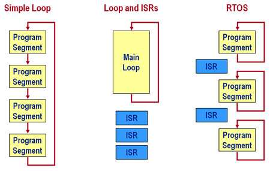
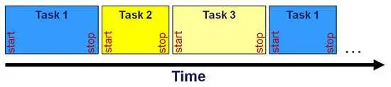
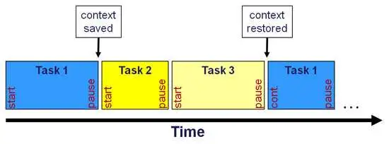
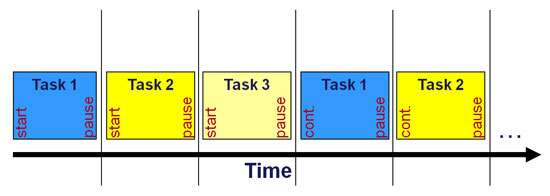
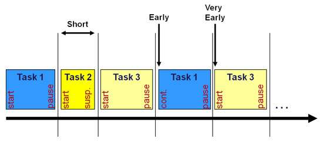
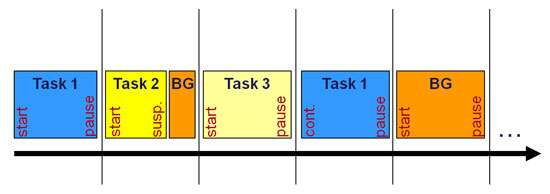
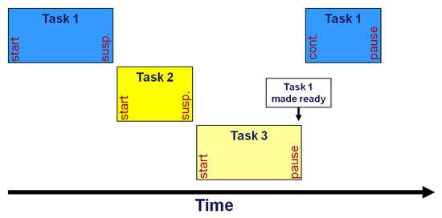

# A multitasking kernel in one line of code - almost

Original Article
*A multitasking kernel in one line of code – almost*
 September 8, 2014 Colin Walls
 embedded.com

In a world dominated by real-time operating systems with enormous arrays of functionality and full-scale operating systems like Linux, it can be useful to stand back and consider the basics. What if you just need some basic multi-threading? How complex does that need to be? In this article, some ideas are proposed for almost trivially simple multi-threading, which might even be implemented in a single line of code!

## Why multitask?
Almost all embedded systems run specific software as soon as they are powered up and continue to do so until they shut down. Broadly speaking, that code can take three architectural forms (**Figure 1**), with increasing complexity (and flexibility):

**1) A single, infinite loop.** The code simply performs a sequence of actions, then goes back and does it all again indefinitely. This structure has the benefit of extreme simplicity, but has drawbacks. The downsides are twofold: the code is not scalable, as adding additional code is likely to affect (probably adversely) the existing functionality; if one part of the code misbehaves (maybe hangs waiting for some external event), the whole application is affected.

**2) A loop that is augmented by interrupt service routines (ISRs).** The infinite loop takes care of the main operations of the device; the ISRs deal with external events. The ISRs should be short and simple and just provide data for processing in the main loop, with minimal intrusion. This architecture is more complex, but somewhat more flexible and scalable, with limitations.

**3) A number of independent loops, augmented by ISRs.** Many applications lend themselves to this kind of architecture, which may be implemented using a multitasking kernel of some kind. The implementation is more complex than the other two architectures, but offers greatest flexibility and scalability.


*Figure 1 – Program architectures for multitasking*

Each of these architectures should be considered in turn, taking into account not only the requirements of the current implementation, but also the likely future enhancements and extensions to the application. It is unwise to "fast forward" to (3), as one of the other two approaches may be satisfactory and simpler implementations are always to be favored.

However, it is common for developers to conclude that a multitasking model is the best option. That being the case, details of its implementation must be addressed, and that normally involves the deployment of a multitasking kernel. Most embedded CPUs are only capable of supporting a single thread of code execution at any given time. The purpose of a multitasking kernel is to enable the developer to code as if the CPU can execute multiple threads (tasks) simultaneously.

## Scheduling methods
To perform the magic of making a CPU appear to run multiple threads, a multitasking kernel needs to continually swap between the execution of all the tasks, thus giving the impression of simultaneity. In reality the tasks are sharing CPU time. The management of this sharing process is called 'scheduling'.  
There are a number of approaches to scheduling, with increasing complexity:

* Run to completion
* Round robin
* Time slice
* Time slice with background
* Priority
* Composite
* Run to completion scheduling

The very simplest form of multitasking uses 'run to completion' scheduling (**Figure 2**). Once a task is started it runs until completed, then control is returned to the kernel. It is a requirement that each task cooperates and does not hog CPU time.


*Figure 2: Run to completion scheduling*

Ultimately, run to completion scheduling is little more than the implementation of an infinite loop (architecture #1 above). However, there is some structure and the kernel may provide some additional services. A run-to-completion scheduler may be written entirely in C and does not require any assembly language coding.

## Round robin scheduling
The problem with run-to-completion scheduling is that each task must terminate and then when it is scheduled again, it starts from the beginning. The code might use a static state variable to figure out what to do next, but this is rather untidy.

A better approach is to introduce the capability of context save-and-restore into the kernel. The 'context' is essentially the current value of the machine registers. 'Round robin' scheduling (**Figure 3**) still requires each task to behave responsibly and cooperate, but instead of terminating, a task makes a system call to pause. Its context is saved and the next task is given control.


*Figure 3: Round robin scheduling of tasks*

Next time a task is scheduled, after a pause, it continues execution from where it left off. A context switch inevitably requires some assembler programming.

## Time sliced scheduling
Both run to completion and round robin scheduling require cooperation from each task. If a task were to hold on to the CPU for too long, the functionality of the other tasks would be adversely affected. This is often not acceptable, so some kind of pre-emptive scheduling is needed, where the scheduler can wrest control of the CPU from a task when it is time to schedule another one.

A simple pre-emptive mechanism is 'time sliced' scheduling. A timer interrupt is used to trigger the scheduler at an appropriate interval, which suspends the current task and wakes up the next in the sequence. This approach ensures that each task gets an even share of the CPU time.


*Figure 4: Time-slice scheduling of tasks*

There are a couple of problems with a simple time slice like this. The first is what to do if a task has no further useful work to perform until another task has processed some data. What should it do? Simply looping is wasteful of CPU time, so a call to invoke the scheduler ahead of the next timer tick seems logical (**Figure 5**). The drawback of this adjustment is that there is no way for a task to make effective use of its regular scheduling to behave in a real time fashion.


*Figure 5: Invoking a scheduler at the wrong time prevents real time operations*

## Time slice with background scheduling
A way to clean up time-sliced scheduling is to introduce a background task (**Figure 6**) consisting of code (presumably low priority – maybe self-test) which is run when the scheduler does not have a normal task to run.

This may occur under two circumstances. First, if a task goes to sleep, the background task is run for the remainder of the task's time slot. It also occupies future slots belonging to that task until the task is awakened again. There may also be a mechanism whereby the task simply relinquishes the rest of its time slot without actually going to sleep.


*Figure 6: Using a background task for time slice scheduling*

Although time-sliced scheduling has the virtue of predictability – you always know when a task will run and how often – it is somewhat inflexible. Introducing another task would entail careful adjustment of time slots to ensure the real-time behavior of the code is unchanged.

## Priority scheduling
In order to offer more flexibility, the majority of commercial real-time operating systems (RTOSes) offer priority scheduling (**Figure 7**). That is, each task is assigned a priority. When the scheduler is activated, it looks at which tasks are ready to run and hands control to the one with the highest priority. This task continues until either it relinquishes control (suspends somehow) or an external event results in a higher priority task being made ready.


*Figure 7: In priority scheduling each task is assigned a priority*

## Composite scheduling
Priority scheduling presumes that every task has its own unique priority level. There are indeed RTOS products that work in this way. However, others enable the developer to assign the same priority to multiple tasks. So, what happens when there are two tasks of the same priority, both of which are ready to run? The answer is that some further scheduling needs to be added on top of the use of priority. Either the tasks at the same level are run on a round robin basis or they are time-sliced. Both may be available with a given RTOS.

## Additional kernel services
Most kernels offer more than just task scheduling, such as services for timing, inter-task communication, and memory allocation. The availability of these services may make even a kernel with a semi-trivial scheduler worthwhile, as the resulting application code will be structured in a readable way, with clean interfaces. It is also scalable if the application becomes more complex and a more sophisticated kernel is needed down the line.

## As close as you can get to one line
You cannot write a real kernel in one line of code, of course, but the core of a run-to-completion scheduler is close:

```c
#define NTASKS 3

void (*tasklist[NTASKS])() = {alpha, beta, gamma};  
int taskcount;

while (1)  
{  
    for (taskcount=0; taskcount<NTASKS; taskcount++) 
        (*tasklist[taskcount])();  
} 
```

Being written in C, it actually could be arranged in one line. *But please do not do this.*

## Conclusion
The ability to structure an embedded application as a number of tasks that appear to execute concurrently is very useful. There are a wide range of options for such an implementation with varying amounts of complexity and flexibility. As is so often the case with embedded software, one size does not fit all.

***Colin Walls*** *has over thirty years experience in the electronics industry, largely dedicated to embedded software. A frequent presenter at conferences and seminars and author of numerous technical articles and two books on embedded software, Colin is an embedded software technologist with the **Mentor Graphics Embedded Software Division**, and is based in the UK. His regular blog is located at: **mentor.com/colinwalls**. He may be reached by email at **colin_walls@mentor.com**.*

## Continue Reading [^1]

[^1]: [A multitasking kernel in one line of code - almost - Embedded.com](https://web.archive.org/web/20240527070828/https://www.embedded.com/a-multitasking-kernel-in-one-line-of-code-almost/#:~:text=Full%20document,more%20information.)